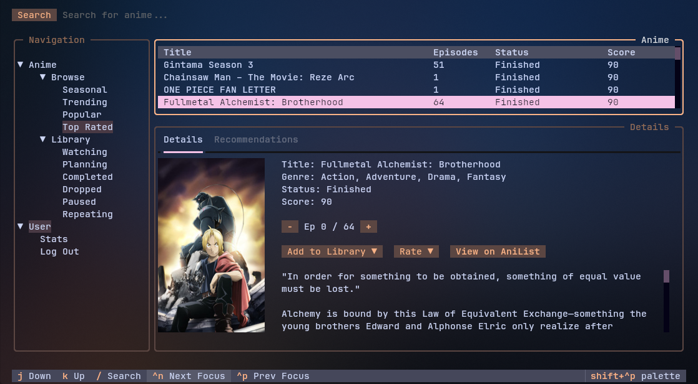
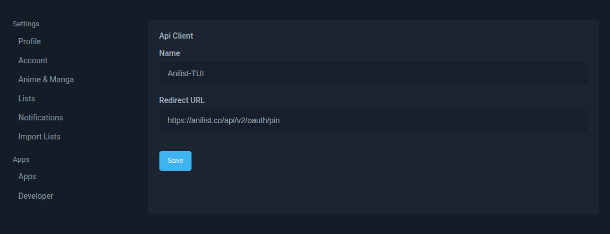
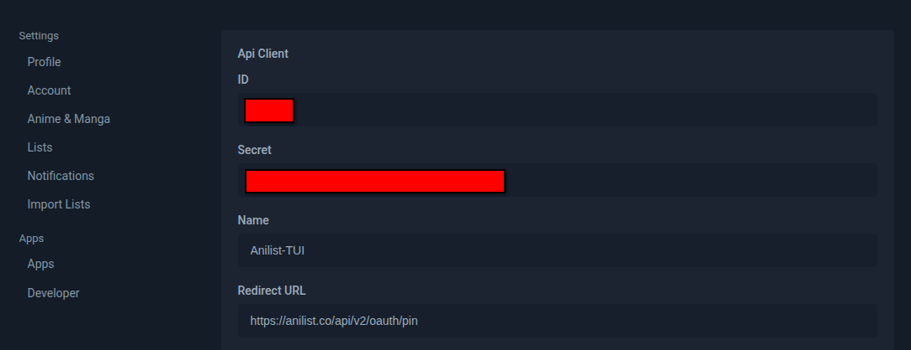
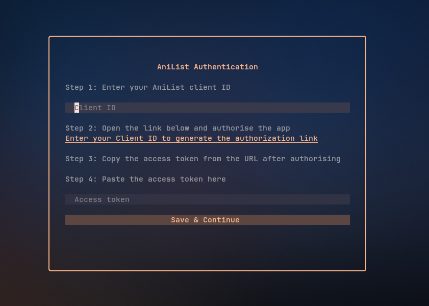
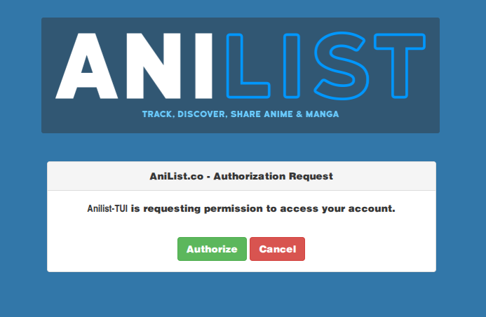
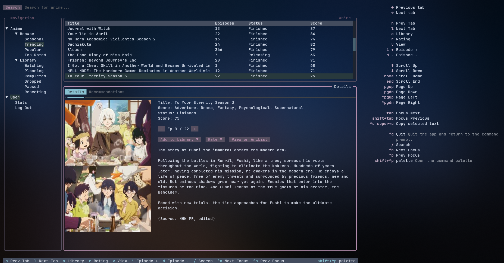
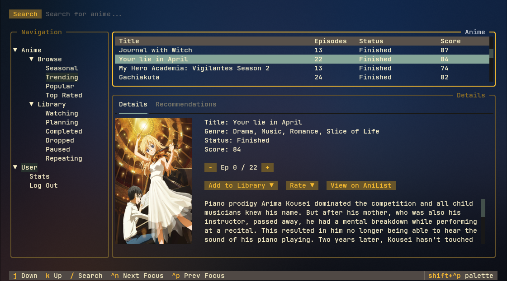
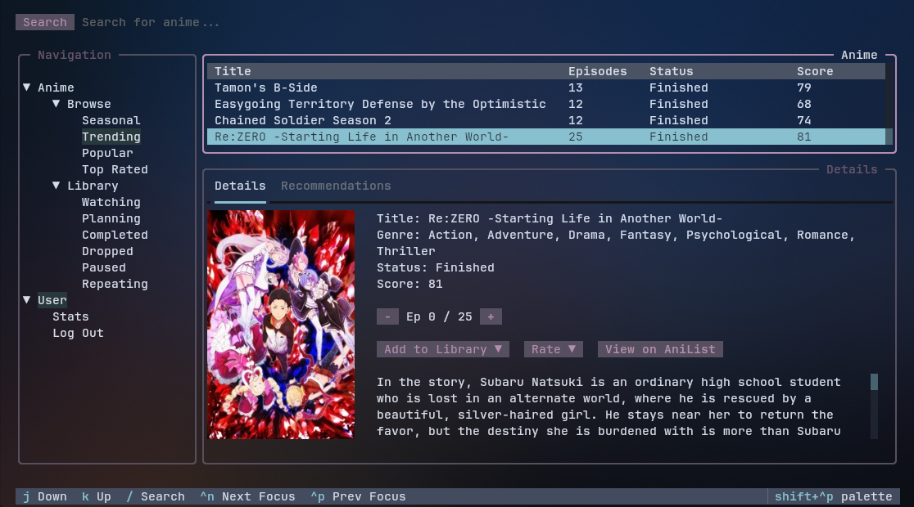

# AniList-TUI

AniList-TUI is a terminal user interface for browsing anime, searching titles, and managing your AniList library without leaving the terminal.

## Preview

Main preview:



## Client ID configuration

- The login screen asks for your AniList client ID and saves it in `~/.config/anilist-tui/auth.json`.
- You can override it at runtime using environment variable `ANILIST_CLIENT_ID`.
- Resolution order: `ANILIST_CLIENT_ID` -> saved client ID.

Create your AniList client:



Then get the client details (Client ID):



When you launch Anilist-TUI for the first time, you get this screen:



Paste the Client ID and click on the URL generated to authorize the app.



Click on authorize and copy and paste the token in the input field in AniList-TUI

This will generate your token and store it locally in `~/.config/anilist-tui/auth.json`.

## Features

### Browse anime

- Browse curated feeds:
	- Seasonal (auto-detected by current season and year)
	- Trending
	- Popular
	- Top Rated

### Search

- Search anime from anywhere using the search bar.
- Search results are loaded from AniList in popularity order.

### Library management

- Open personal library views:
	- Watching
	- Planning
	- Completed
	- Dropped
	- Paused
	- Repeating
- For a selected anime, you can:
	- Add or change library status
	- Remove from library (clear status)
	- Update watched episode progress
	- Set rating using AniList 3-point scale (`:(`, `:|`, `:)`)

### Anime details and recommendations

- Detailed panel for selected anime:
	- Title, genres, release status, average score
	- Episode progress counter (`Ep X / Y`)
	- Full description (HTML converted to readable markdown text)
	- Cover image
- Recommendations tab with selectable recommended titles.
- Selecting a recommendation loads that anime’s details immediately.
- Open the selected anime page directly in your browser.

### User stats screen

- Dedicated user stats screen (`User -> Stats`) with:
	- Username and AniList profile link
	- Anime totals (entries, episodes, minutes watched, mean score)
	- Manga totals (entries, chapters, volumes, mean score)
	- Profile avatar

### Performance and UX

- In-memory caching for lists and search results to reduce repeat API calls.
- Vim-style navigation in tree/table widgets (`j` / `k`).
- Focus navigation shortcuts and command palette support.
- Responsive table/image resizing based on terminal size.

## Requirements

- Python 3.12+
- AniList account

## Installation

### Quick install (recommended)

This script installs `uv` if needed, then installs `anilist-tui`:

```bash
curl -LsSf https://raw.githubusercontent.com/pndpti/anilist-tui/master/install.sh | sh
```

### Install as a uv tool manually

```bash
uv tool install -U anilist-tui
```

Then run it from anywhere:

```bash
anilist-tui
```

To remove it:

```bash
uv tool uninstall anilist-tui
```

## Commands and keybindings

The table below lists app commands and where they apply.

| Keys | Action | Where it works |
| --- | --- | --- |
| `Ctrl+Shift+P` | Open command palette | Global |
| `/` | Focus search input | Global |
| `Ctrl+N` | Move focus to next widget | Global |
| `Ctrl+P` | Move focus to previous widget | Global |
| `Tab` | Move focus to next widget | Search input |
| `j` | Move cursor down | Anime tree, user tree, anime table, recommendations table |
| `k` | Move cursor up | Anime tree, user tree, anime table, recommendations table |
| `h` | Switch to Details tab | Details panel |
| `l` | Switch to Recommendations tab | Details panel |
| `a` | Focus/open library status select | Details tab only |
| `r` | Focus/open rating select | Details tab only |
| `v` | Open selected anime on AniList in browser | Details tab only |
| `i` | Increment watched episode count | Details tab only |
| `+` | Increment watched episode count | Details tab only |
| `d` | Decrement watched episode count | Details tab only |
| `-` | Decrement watched episode count | Details tab only |
| `j` / `k` | Move within open select dropdown | Library/Rating dropdown overlay |
| `Escape` | Close open select dropdown | Library/Rating dropdown overlay |
| `q` | Back / close stats screen | User stats screen |

Command preview:



## Themes

AniList-TUI currently uses only Textual’s built-in themes (no custom app themes yet).

- App default theme: `catppuccin-mocha`
- Theme is loaded from `~/.config/anilist-tui/config.toml`:

```toml
[ui]
theme = "catppuccin-mocha"
```

Other theme previews:

| Gruvbox | Nord |
| --- | --- |
|  |  |

### Built-in Textual themes available

| Theme |
| --- |
| `textual-dark` |
| `textual-light` |
| `nord` |
| `gruvbox` |
| `catppuccin-mocha` |
| `textual-ansi` |
| `dracula` |
| `tokyo-night` |
| `monokai` |
| `flexoki` |
| `catppuccin-latte` |
| `catppuccin-frappe` |
| `catppuccin-macchiato` |
| `solarized-light` |
| `solarized-dark` |
| `rose-pine` |
| `rose-pine-moon` |
| `rose-pine-dawn` |
| `atom-one-dark` |
| `atom-one-light` |

## Configuration files

- Auth/session: `~/.config/anilist-tui/auth.json`
- UI config: `~/.config/anilist-tui/config.toml`
